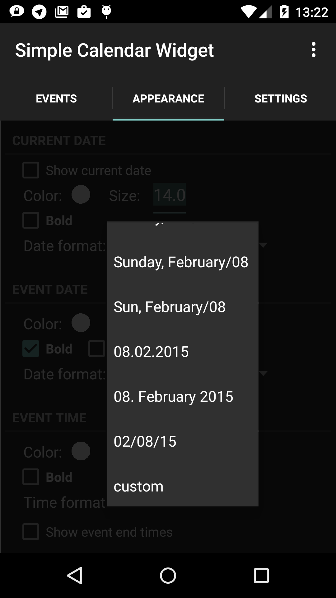
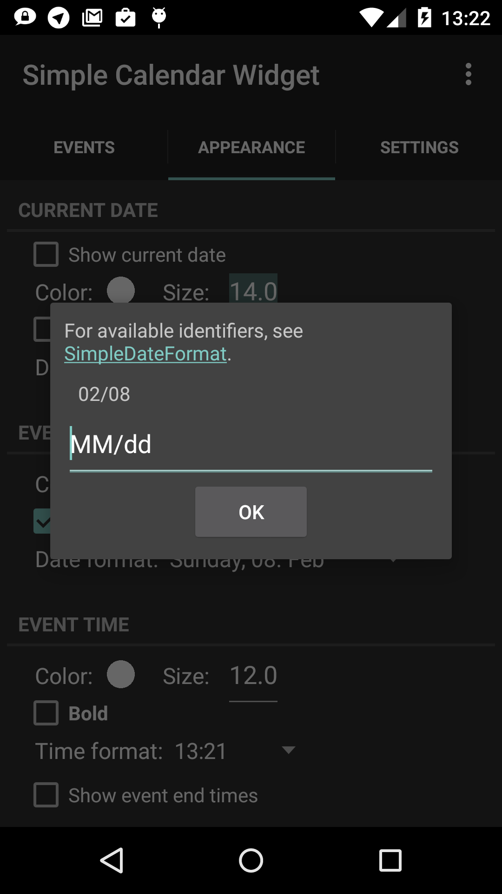

dateFormatSpinner
=================

<table sytle="border: 0px;">
<tr>
<td></td>
<td></td>
</tr>
</table>


Usage
-----
Add a spinner for date formats
```xml
        <de.j4velin.dateFormatSpinner.DateFormatSpinner
            android:id="@+id/date"
            android:layout_width="wrap_content"
            android:layout_height="wrap_content"
            spinner:defaultFormats="date"/>
```
or for time formats
```xml
        <de.j4velin.dateFormatSpinner.DateFormatSpinner
            android:id="@+id/time"
            android:layout_width="wrap_content"
            android:layout_height="wrap_content"
            spinner:defaultFormats="time"/>
```
to your layout xml file.
To use the selected format in your code, call the getValue() method on the Spinner:
```java
        String pattern = ((DateFormatSpinner) getView().findViewById(R.id.date)).getValue();
        String formatedDate = new SimpleDateFormat(pattern).format(System.currentTimeMillis());
```
